# Motorized Macro Rail

This is a project for a motorized macro focusing rail.  It is used with special
"stacking" software to increase the depth of field of macro images.  This
project is presented as a modification to an existing commercial rail, but could
be extended to use a custom built rail (using steel rods and linear
bearings commonly used in at-home 3D printers and CNC mahines).

## Background

Taking images of very small objects is known as [macro
photography](https://en.wikipedia.org/wiki/Macro_photography).  Using a
[specialized
lens](https://www.bhphotovideo.com/c/product/1399604-REG/venus_optics_ve2528sfe_laowa_25mm_f_2_8_2_5_5x.html),
or an [attachable
modifier](https://www.bhphotovideo.com/c/product/275182-REG/Raynox_DCR_250_DCR_250_2_5x_Super_Macro.html)
makes this type of photography possible.

Due to the [physics of photographic lenses](https://en.wikipedia.org/wiki/Depth_of_field), taking photos of very
small objects typically has a very low depth of field, where only a thin plane
of the object appears in focus, often much less than 1mm.

In general photography, it is possible to "stop down" the aperture to increase
the depth of field.  That is true in macro photography as well, but even stopping
down often does not sufficiently address the depth of field problem.

A modern solution is to take many photos where the focus point is slightly
shifted, then combine these using software.  For example, we would take these
photos:


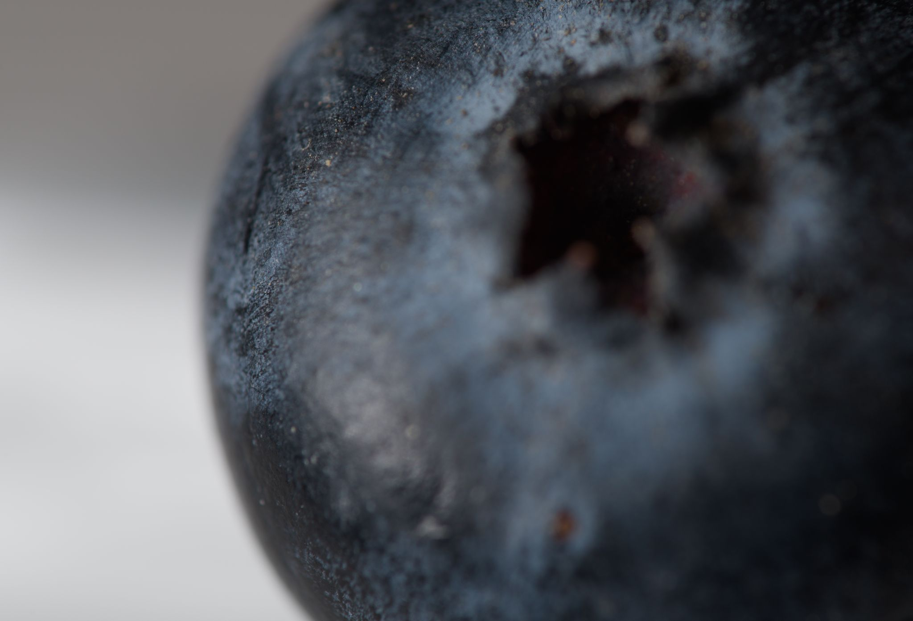
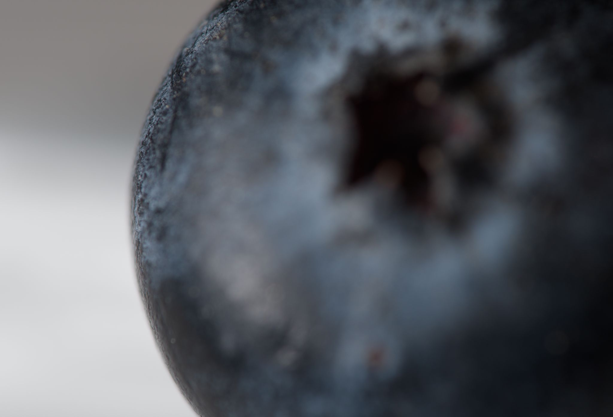
(and 29 more)

and combine them into this "stacked" image:

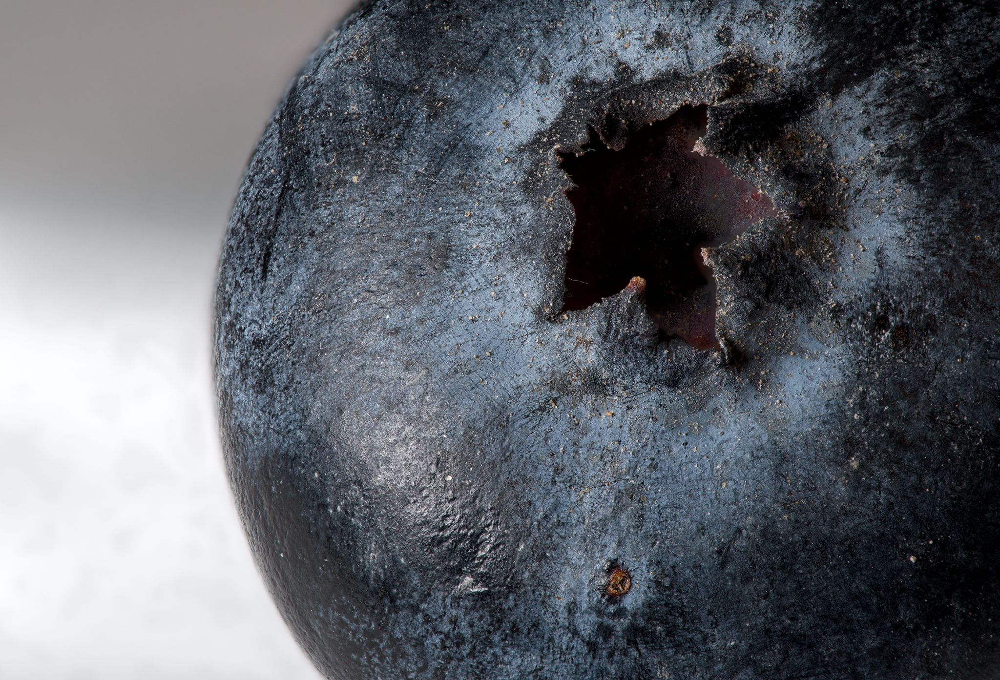

The project here helps to take the capture photos in an automated and
consistent way.

Note that taking these photos requires either a specialized lens, an attachable lens
filter or an extension tube.  There are endless resources on the web on
gettings started.  Here is [one for the basics](https://digital-photography-school.com/macro-photography-for-beginners-part-1/).
Here is one for [extreme macro](https://ferdychristant.com/my-journey-into-extreme-macro-8ddef548e9f3), which is where a rail comes into play.
The amount of detail in this article is impressive and seems beyond what you'll
need to know to start experimenting, but a useful reference as you progress.

## Alternatives

### Manual Approaches

* You can use manual focus on your lens to vary the focus distance. That said,
it can be challenging to get the step size correct and consistent (especially on a
lens not designed primarily for manual focus).  The final stacked image will
thus often have "blurry" areas where there was no in-focus source image to use.
There is also the risk of moving the camera every time you touch it.  Still,
this can be a great way to start and get famiiar with the process.  This method
also does not limit you to small objects as stacking larger scenes can be useful
too.
* You can buy a manual focus rail at many different qualities and price points.
That is the starting point for this project.  The nice thing about these rails
is that they simple to use and easy to pack up for field work.  The downside is
that using them manually can feel like tedious work and you risk moving the
camera and introducing vibrations as you interact with the rail.

### Automated approaches

* You can buy commercial rails at different price points.  Here is
[one](https://cognisys-inc.com/stackshot-macro-rail-package.html) and
here is [another](https://www.wemacro.com/US/index.php/product/wemacro-rail-with-power-bank-cable-for-outside/).
Price aside, I think a downside of these solutions is the
interface.  One uses buttons and the other uses a phone app - both seem a bit
cumbersome compared to an analog stick when it comes to positioning the camera.
* [Some cameras](https://fujifilm-x.com/en-gb/learning-centre/using-focus-bracketing-and-stacking/)
have built in [focus stacking](https://en.wikipedia.org/wiki/Focus_stacking)
features while others support remote
control phone/computer [apps](https://camranger.com/camranger-2/) that add the
feature. A limitation here is that you will be limited to autofocus lenses and
[higher-magnification](https://www.bhphotovideo.com/c/product/1712870-REG/venus_optics_ve9028fe_laowa_90mm_f_2_8_2x.html) lenses usually do not offer autofocus as an option.

## Parts List

These are the parts and equipment I used.  Of course, any of them could be
swapped with alternatives with varying degrees of challenge depending on the
part:

### Parts

Prices are what I found in late 2024.  I am mostly suggesting
[Digikey](http://www.digikey.com) here because they let you purchase low part
counts.


* [Stepper motor](https://www.amazon.com/gp/product/B0B93L4H57) ($11) Any Nema 17 motor designed
for 3D printers will work well.  I'm using a lower power pancake style motor, which is still
sufficient for the job (as the leverage on a macro rail knob is very high)
* [Raspberry PI Pico](https://www.digikey.com/en/products/detail/raspberry-pi/SC0915/13624793) ($4).  You could
opt for the [unit with Wifi/Bluetooth](https://www.digikey.com/en/products/detail/raspberry-pi/SC0918/16608263)
if you want to try and trigger your camera wirelessly but note that this
enhancement will require firmware changes and could be a challenge.
* [128x128 OLED](https://www.amazon.com/dp/B0CFF435XZ) ($12).  The UI is 
designed for this resolution using a 8x16 font.  With some firmware changes, you
could go with a 128x64 and switch to an 8x8 font.  See
[src/firmware/README.md](src/firmware/README.md) for more details.
* [4 push-buttons](https://www.digikey.com/en/products/detail/schurter-inc/1301-9314-24/8536705) ($1).
* [Joystick](https://betafpv.com/products/literadio-transmitter-nano-gimbal-for-literadio-3-and-2-se?variant=39628763529350) ($6).
I'm using an RC gimbal (pitch-roll type) which gives a feeling of precise control.  You
an get these new or salvage one from an old RC radio.  Alternatively,
you can opt for a commonly-available ["PS2 stick"](https://www.amazon.com/HiLetgo-Controller-JoyStick-Breakout-Arduino/dp/B00P7QBGD2)
that will be less precise but possibly good-enough.
* [Voltage Regulator](https://www.digikey.com/en/products/detail/texas-instruments/LM7805CT-NOPB/3901929) ($2) most stepper
motors need a minimum of 12V, which is beyond what the PI Pico onboard regulator
can accept as input, thus you'll need a regulator to help it out.  I went with the famous
[LM7805](https://www.digikey.com/en/products/detail/texas-instruments/LM7805CT-NOPB/3901929) which will be powering the Pico
and OLED.  Anything between 3.3V and 5V which can deliver > 200 mA should be well
into the sufficiency range.
* [A4988 Stepper Motor Driver](https://www.amazon.com/HiLetgo-Stepstick-Stepper-Printer-Compatible/dp/B07BND65C8) ($2).
A Pico microcontroller is not designed to power a motor directly and you will need
power electronics.  The [A4988](https://www.pololu.com/file/0j450/a4988_dmos_microstepping_driver_with_translator.pdf)
gives you both the power and an easy-to-use interface which make the motor run smooth and quiet (using microstepping) and provides a number of protections (such as overcurrent protection).
* [Power connector](https://www.amazon.com/dp/B09128LHGG) ($2).
I'm going with a XT-60 connector used with RC LIPO batteries but it's really up to you.  The design will
support between 12V and around 30V but you'll want to double check the limits
of your chosen motor and voltage regulators.
* [Camera remote shutter release](https://www.digikey.com/en/products/detail/same-sky-formerly-cui-devices/SJ1-2503A/738680) ($1).  I went with
a 2.5mm jack for this but since it's the not the camera side, your options
are flexible.  Many cameras support a simple electronic shutter release.  If yours
doesn't, you can probably improvise something or go with the manual shutter
release option the firmware provides (more on that later).
* [4N25 Optocoupler](https://www.digikey.com/en/products/detail/liteon/4N25/385762) (<$1)
This is used to trigger the camera.  An [optocoupler](https://en.wikipedia.org/wiki/Opto-isolator) triggers the camera using light,
meaning that the electrical system of the camera and focus rail are fully isolated.  This electrical
isolation can bring some peace-of-mind about connecting your camera.
* [100 Ohm resistor](https://www.digikey.com/en/products/detail/vishay-dale/RLR07C1000GSB14/3141196) (<$1)
The optocoupler needs one of these.
* [470 uF capacitor](https://www.digikey.com/en/products/detail/rubycon/6-3YXJ470M6-3X11/3134408) (<$1)
The a4988 motor driver requests one of these on the motor voltage input to smooth
out voltage transisents that are common with powering motors.
* [2x 10 uF capacitor](https://www.digikey.com/en/products/detail/tdk-corporation/FK28X5R0J106MR000/2815522) (<$1) These help smooth the 5V power supply.

You will also need a rail.  I went with the [NM-200s](https://www.amazon.com/dp/B0BXKFGLF3?th=1)
which I acquired on sale for $150.  I'd say the [NM-180s](https://www.amazon.com/dp/B08BCCFQC3)
is likely as good for $130 retail.  There are also a number of cheaper options that I have no
direct experience with, such as [this one for $89](https://www.amazon.com/Adjustment-Photography-360%C2%B0Rotating-Compatibility-MS18/dp/B0C89CLJ8N).  If you go with a NM-XX0s rail as I used, you can use the provided `.STL` files directly.  For other rails
you will need to resize the adapter using the free OpenSCAD and instructions provided later
in this document.

### Equipment

* 3D printer.  This is used to create the motor-to-rail interface and
the housing for the electronics.  There are many techniques with wood working,
metalworking, [CNC](https://www.sainsmart.com/products/sainsmart-genmitsu-cnc-router-3018-pro-diy-kit),
etc, that could be alternatively used if you have the needed skills and equipment.
* Camera gear.  More on that in the process walkthrough later.  In short, just about
any camera with interchangeable lenses can be used. 

## Electronics Build

Here is the schematic.

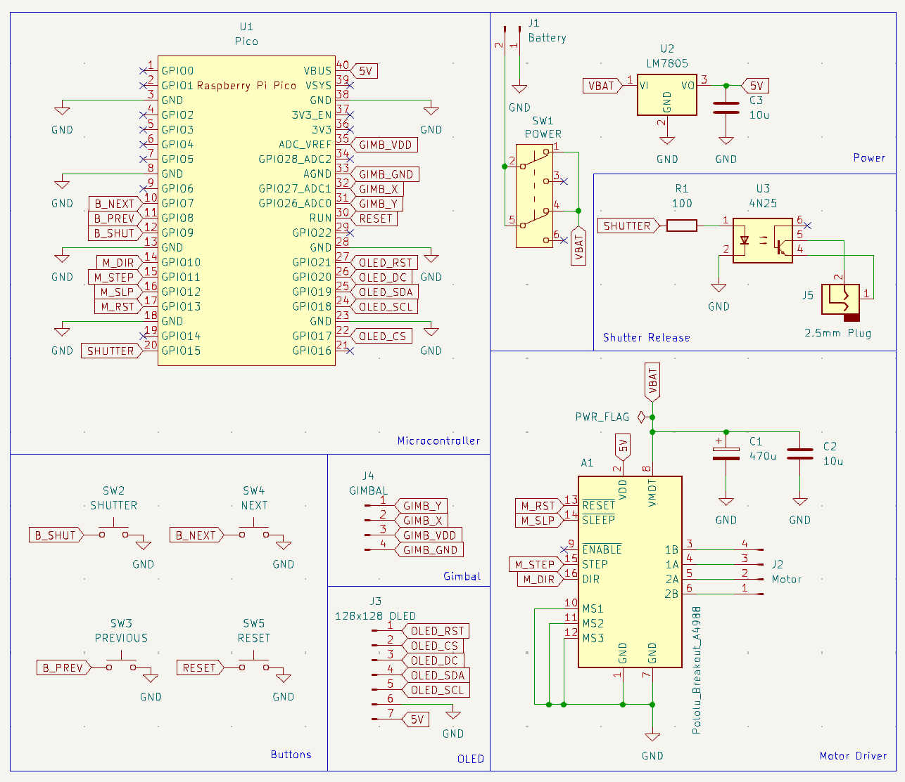

There are around 2 dozen connections to be made here which makes most
assembly methods possible.  Here is the whole thing implemented on
a breadboard:

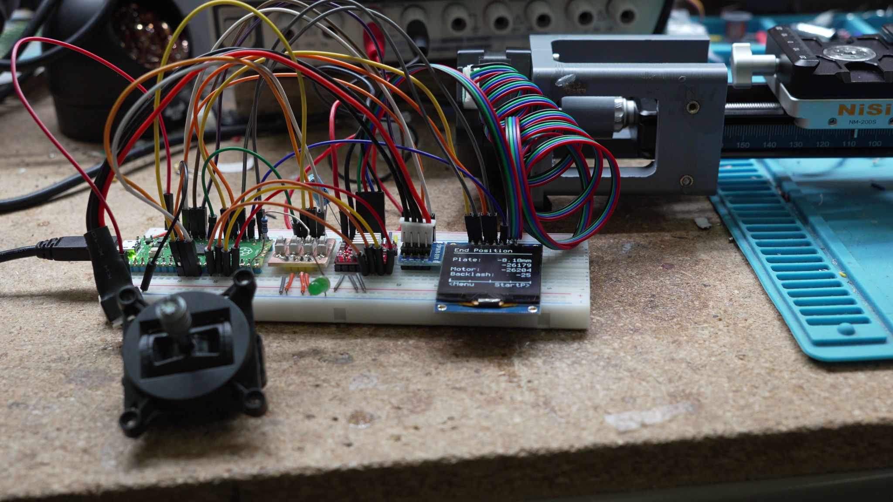

You could transfer the electronics to a [perf board]() and be done
with this step.  

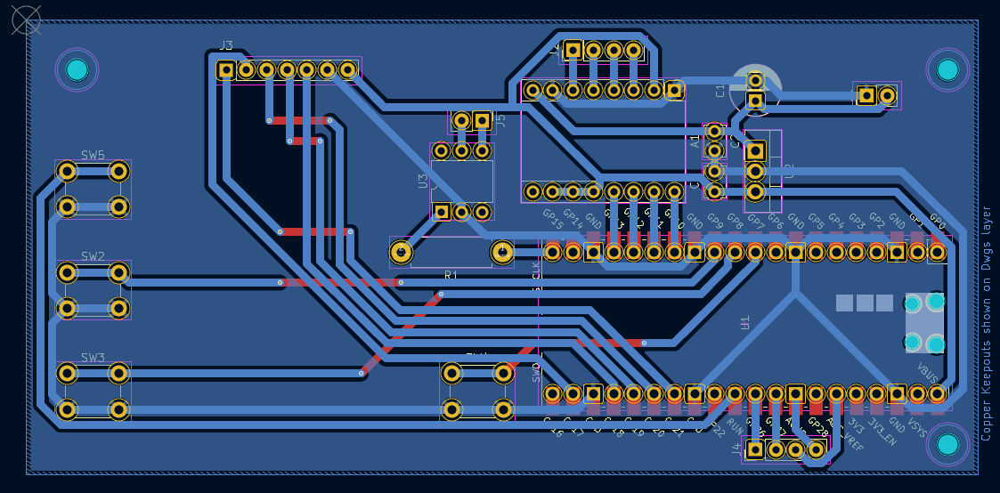

Since I have a 3018 CNC machine, I decided to go a little farther and cut out a PCB:

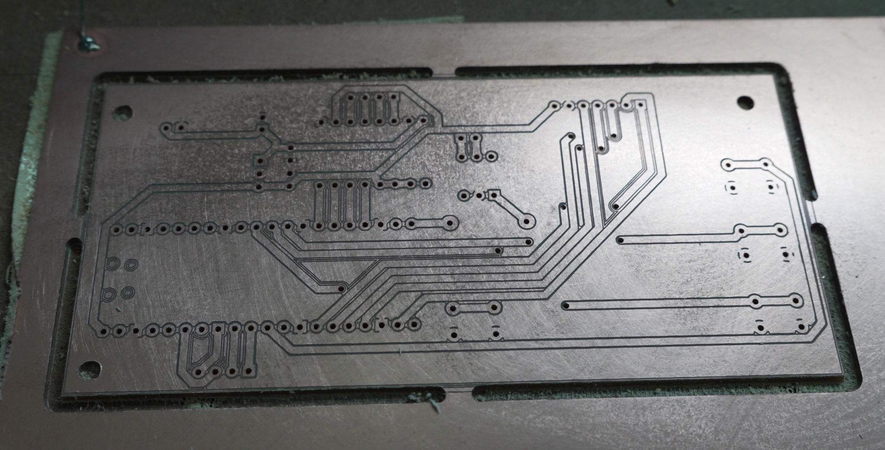

Here is the board flipped over and populated with components:

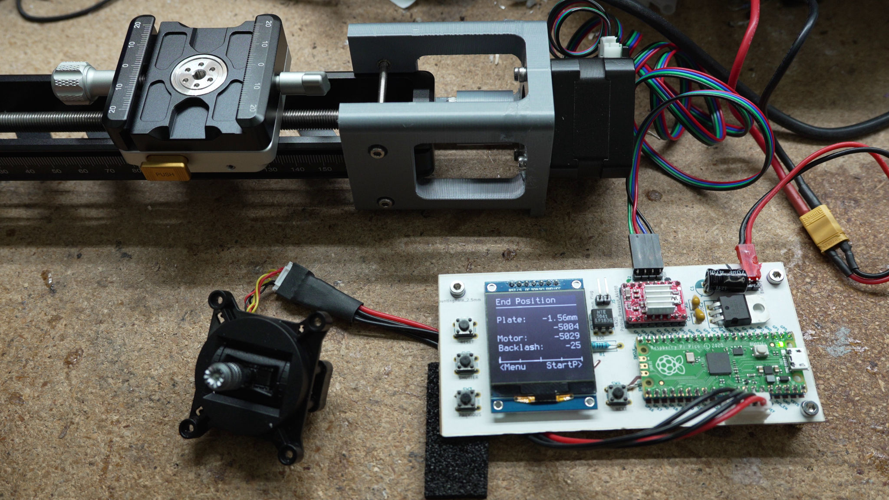

If you want to use a CNC, chemical etch, or order a manufactured board,
you can find the needed files in the [`motor_rail_kicad/`](motor_rail_kicad) directory.

## Code Build

Here you have the "easy" option of uploading a precompiled `.uf2` file to your
Pico or the "flexible" option of building the binary yourself.  Both options are
free.

### Precompiled

There are many guides for how to do this, just a Google search away. Here is my
version.

* While holding down the `BOOTSEL` button, plug in the Pico via USB
* It should mount as a USB drive
* Copy the [`firmware/macro_rail_automater.uf2`](firmware/macro_rail_automater.uf2) file to the USB drive
* Unplug and replug the Pico

There are alternatives you can explore as well:

* There is a [`picotool`](https://github.com/raspberrypi/picotool) program which
allows you to load the `macro_rail_automater.uf2` file directly.  I prefer it.
* [Pin 30 on the Pico](https://www.raspberrypi.com/documentation/microcontrollers/pico-series.html#pinout-and-design-files) is named `RUN`.  If you drive it to 0V, it will reset the PICO.
If you do this while holding `BOOTSEL`, you can upload firmware which is
ergonomically easier and with less USB port wear-and-tear.  I
put a switch between `RUN` and ground (battery negative) whenever I go with a
Pico for this reason (as is done in the schematic above).

### Build firmware yourself

To start, you'll need a working development environment.  I'll point you to the
[official docs](https://datasheets.raspberrypi.com/pico/getting-started-with-pico.pdf) if you are not there yet.  I personally prefer following Appendix C "Manually configure your environment" first over the VS Code docs, then add VS Code later so I have both options available.

Once your blinking light project is working, your should be close to done.  Here
are the command line instructions (use the official Pico docs as a guide for VS Code)

* First, go into the [`src/`](src) directory.
* In Linux, type [`./bootstrap.sh`](src/bootstrap.sh).  In Windows, you'll need to follow
the steps listed in `./bootstrap.sh` which are identical to the official
docs.
* `cd build`
* `make`

At this point, you'll hopefully have your own `macro_rail_automater.uf2` file that you can load
on the your Pico.


## Macro Rail Physical Interface

The goal is to interface the stepper motor with the macro rail of your
choosing.  I ended up going with the [NM-200s](https://www.amazon.com/dp/B0BXKFGLF3)
focusing rail which I find sufficient but not amazing.  It has some flex which
leads to some shifts between photos but the stacking software compensates for this.
I *might* try a cheaper one or potentially DIY one with some steel rods and
linear bearings, if I find the time/motivation.

For the route I took, only two printed parts are needed.  One interfaces
the rail to the motor using a clamping interface:

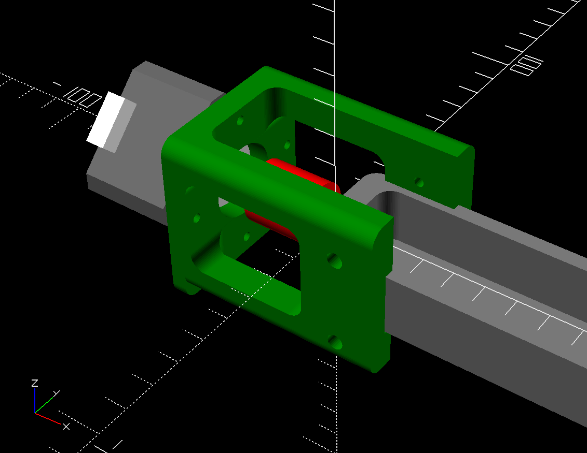

The other printed part interfaces the motor shaft to the finger adjustment
knob:

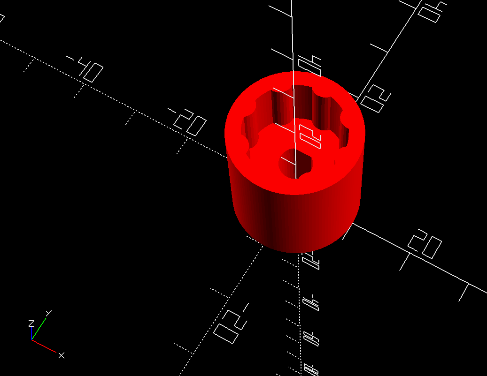

I have included rendered `.stl` files in the [motor_mount/stl](motor_mount/stl)
directory that you make be able to use directly if you have a compatible rail.

If you do not have a a matching rail, you can probably make a few tweaks to the
model and have a working result.  By using the freely-available [OpenSCAD](https://openscad.org/), you can adapt
the clamp interface to various different rails by editing
[`motor_mount/focus_rail.scad`](motor_mount/focus_rail.scad) and changing
the following parameters to match your rail:

```
RAIL_BODY_WIDTH = 37.8;
RAIL_BODY_HEIGHT = 20;
```

The numbers above (in mm) are for the [NM-200s](https://www.amazon.com/dp/B0BXKFGLF3).

The knob interface design should be adaptable to most (but not all) rail
designs.  The file to change is [`motor_mount/knob.scad`]() with the following
variables likely being relevant:

```
KNOB_DIAMETER = 15.1;
KNOB_INSET_DIAMETER = 13.2;
...
finger_cutout_diameter = 4;
finger_cutout_count = 8;
```

## Motor Current Calibration

You will need to calibrate your A4988 driver board to set the current properly
for your chosen stepper motor.  Intructions on how to calibrate are
[here](https://www.pololu.com/product/1182) with alternate instructions
[here](https://ardufocus.com/howto/a4988-motor-current-tuning/).

## Firmware Settings

If you power on the unit and press the "previous button", you are taken to
a menu that lets you chang the following settings:

* Max Velocity: The maximum motor turn speed.  Too high of a value may cause the
stepper motor to miss steps or lead to long spin down times if acceleration
is not risen to match.
* Acceletaion: The maximum motor acceleration/decelleration.  Too high of a
a value may cause the motor to miss steps or lead to rail vibrations.
* Backlash: When the motor switches direction, it will take some slack before
the main gear is engaged, this is known as backlash.  If you want a perfect
value, you can run the test mode with a caliper attached to the rail.
It's usually not critical that this number be fully tuned.
* Settle Seconds: This is how long the controller should wait between
stopping the rail and taking a photo.  The intent is to allow any
vibrations/oscillations from rail decelleration to subside.

### Steps / mm

This final menu item relates to both your motors steps/rotation and
your rails rotations/mm.  The a4988 driver is configured in the schematic
above to 16x microstep mode, meaning that 16 steps equal one step on the motor.
The formula to use is thus:

```
  motor_steps_per_rotation * 16 / mm_per_rotation
```

For my case,
I'm personally using a
[200 steps/rotation stepper motor](https://www.amazon.com/gp/product/B0B93L4H57) and a 
[1 rotation/mm rail](https://www.amazon.com/dp/B0BXKFGLF3),
thus my number will be 200 * 16 / 1 = 3200.

## Controller Case

In the folder [3d_models/controller](3d_models/controller/), there is a file named [controller.scad](3d_models/controller/controller.scad), which OpenSCAD will render like this:

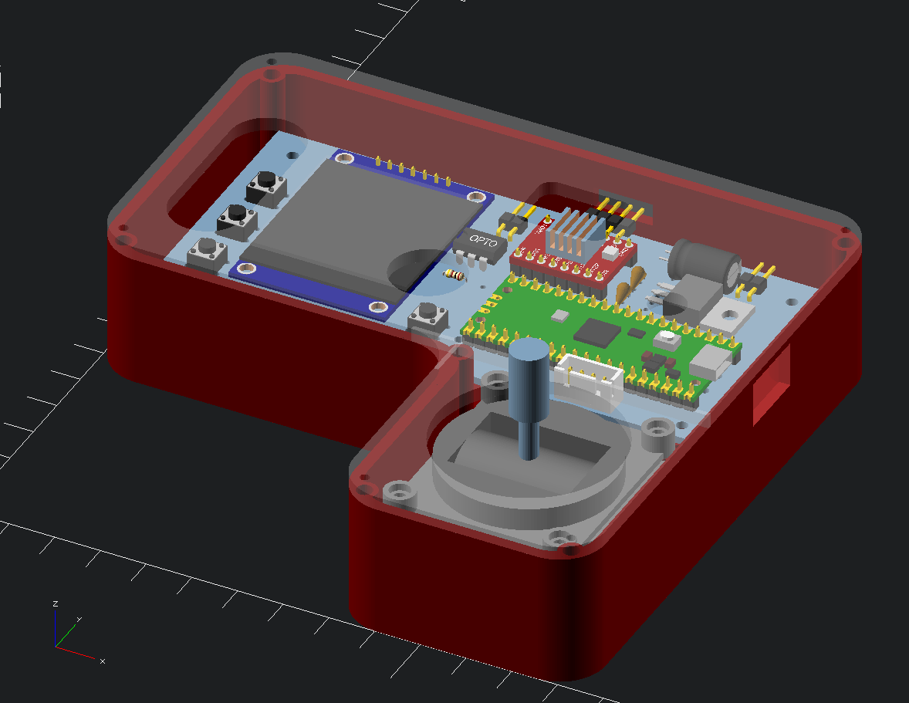

This model is intended for the parts and PCB model that I'm using.  If you went
with different parts, made a differently-shaped PCB, or do not have a CNC
machine for the acrylic cover, you can either try to modify the given design or
make a custom one using whatever parts / methods work for you.

If you want to start with an STL file, you can find one at [3d_models/stl/controller.stl](3d_models/stl/controller.stl)

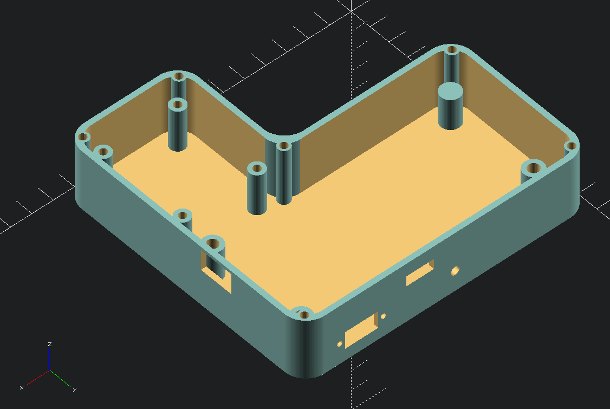

If you want to edit the OpenSCAD model directly, it can be found at
[3d_models/controller/controller.scad](3d_models/controller/controller.scad).
The model is parametric and has many varialbes you can change and experiement
with.  The bottom of the file allows you to turn components on and off using th the usual OpenSCAD prefixes of `*`, `!` and `//`:

```
// comment out everything but controller for the 3d print model
controller(false);
placed_pcb();
placed_gimbal(); 
cover();
// comment out everything but this to create a dxf projection
//cover_projection();
```

The `cover_projection()` can be used to create a `.dxf` export for CNC or a laser cut.
Alterrnatively, you can 3D print the cover, likely with some modifications
to allow the screen to be viewed:

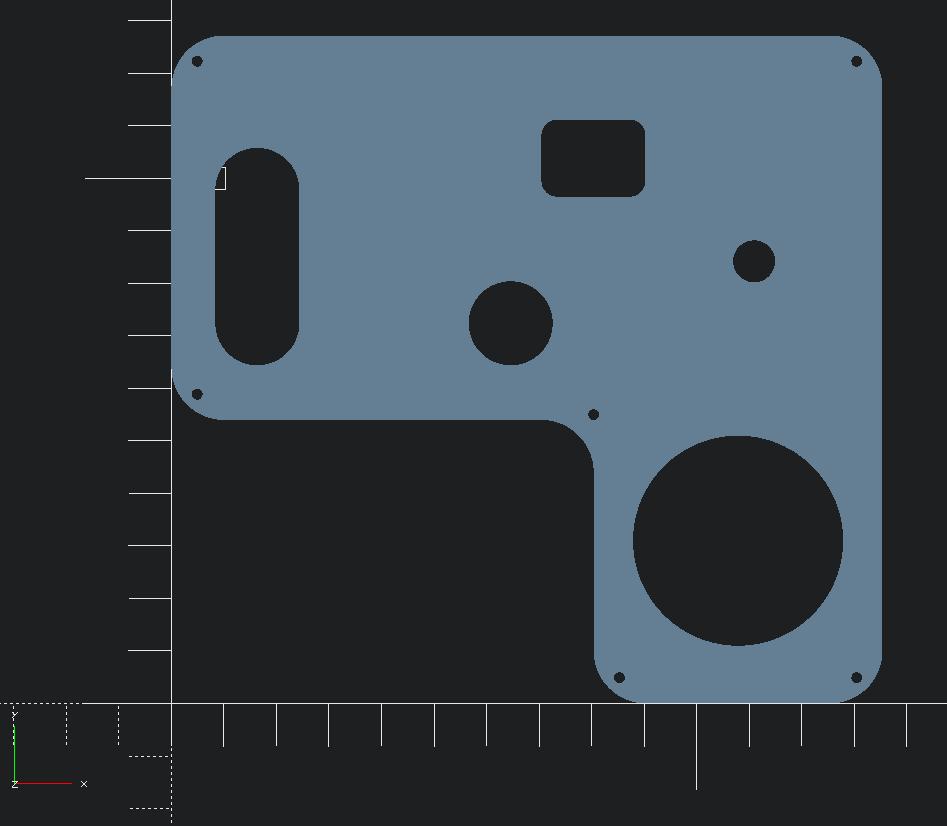

An exported DXF is available at [3d_models/dxf/controller_cover.dxf](3d_models/dxf/controller_cover.dxf) if you would like to use that as your starting point.

## Process Walkthrough

This section talks about the end-to-end experience of using the rail.

### Setup

You first need to attach the stepper motor to the rail by sliding it on and
*gently* tightening the bolts (don't overdo it).  The motor can easily be
detached if you don't need it for a given session.`

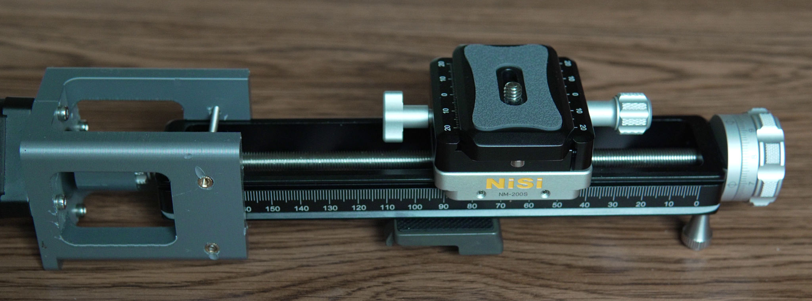

Next line up the camera and target and make sure that nothing is moving.

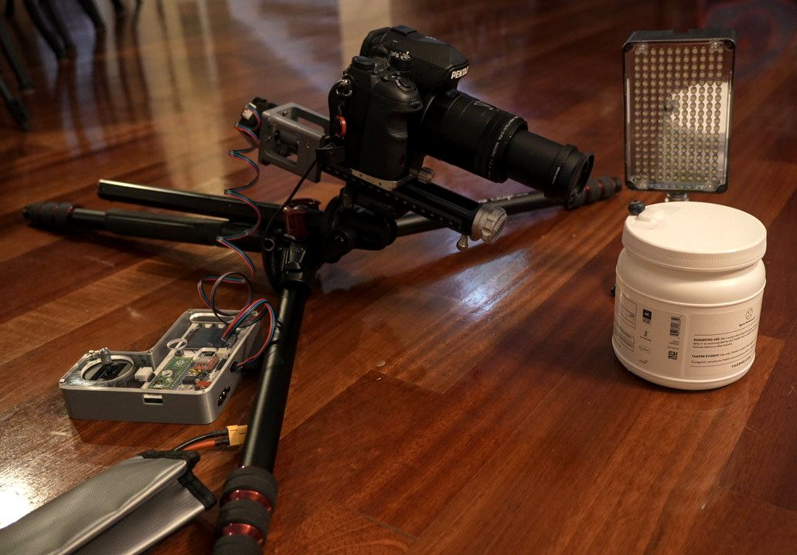

It's good to have a light on your subject to reduce to exposure time and make
the light consistent.  Where you place the light is an artistic choice but side
lighting is a good starting point.  Flash is an option but you might need to
slow down your process to allow the flash to charge between shots.

You'll want manual everything on your camera, focus, shutter speed, aperture,
ISO and white balance.  If these parameters change in any of the photos,
it can create problems with the stacking software.

I suggest f/5.6, f/8 or f/11 for aperture.  Wider apertures will have (possibly
not perceptible) sharpness improvements due to less diffraction but you
will need to take more images to due to less depth of field.

### Find most distant point

Power on the focusing rail and use the joystick to find the farthest out point
(note you can also find the closest point first, if you prefer).


### Find closest point

Hit the 'next' button and find the closest point.


### Choose shot delay

Hit the 'next' button to choose the shot delay. My exposure settings indicate
that a photo will take 1/8th of a second to take.  You also want to think about how
long the camera will take to write the photo to the SD card (most cameras will buffer
shots in memory, but maybe not enough).  If your camera offers a setting for
["electronic shutter"](https://photographylife.com/mechanical-electronic-shutter-efcs),
I suggest turning it on as any amount of
[shutter shock](https://photographylife.com/shutter-shock) is especially
visible during macro work.


If you don't have the remote shutter working with your camera, you have
the option of choosing `0.0` here.  In that case, the rail will pause
after each photo, giving you as much time as you need to manually take
the photo.  In this mode, the "next" button is used to continue.

### Choose image count

The correct image count depends on many variables:

- How magnified the subject actually is
- How many megapixels your camera has and if you plan to pixel peep
- Your choice of aperture setting

You'll need to experiment.  If you do not know where to begin, I suggest f/8
and 0.2mm and see how it goes (or try [this chart](https://www.wemacro.com/?p=529)).

Hit the 'next' button and choose your shot count


### Take photos

Hit the `next` button to take all of the photos.  You can pause/resume the process
with the `next` button or cancel it with the `back` button.  If you find a need
to abort everything quickly or just want to start over, you can press the `reset`
button (I suggest using next/back over reset if the motor is spinning).

When all photos are taken, you have the option of repeating the process in the
reverse direction with the 'next' button or starting over with the 'back' button.

### Load onto computer and run software

I suggest Helicon focus for reasonably priced, turn key software with a free trial
period.  The software is for mac or windows but I am running it in Linux with Wine
and it runs fine.


If you want a free/open source solution, check out the [focus stack](https://github.com/PetteriAimonen/focus-stack)
project.  The main downside of going this route is that the excellent
post-stack retouching features of Helicon are not present, but many people
are able to use the software to produce excellent images regardless:


